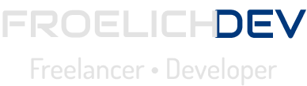

  

## Hi! I'm Eduardo Froelich, I'm glad you want to know me more.

*I'm currently an intern and a web application freelancer. I've been passionate about logical reasoning since I was a child, now as an adult I just remember that no problem is impossible.*

  

 
  
  
  
  
  

##

 
  
  
  

*What I like to do*
- Web Applications (Front-end to back-end).
- Data Science.
- Learn every day.

*My career*
- I decided to learn to program in 2020.
- I thought it would be boring, I discovered my passion.
- I focused on acquiring knowledge and applying it while learning.
- I tried my first PJ jobs and I failed.
- I learned from my mistakes and became better.
- I got my internship at BRF (an amazing company) in the middle of 2021.
- Outside, I continue with my freelance work.
- "I never loose. Either I win or I learn!" - Nelson Mandela.

