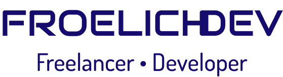

  

## Hi! I'm Eduardo Froelich, I'm glad you want to know me more.

*I'm currently an intern and a web application freelancer. I've been passionate about logical reasoning since I was a child, now as an adult I just remember that no problem is impossible.*

*What I like to do*
- Web Applications (Front-end to back-end)
- Data Science
- Learn every day

*My career*
- I decided to learn to program in 2020
- I thought it would be boring, I discovered my passion
- I focused on acquiring knowledge and applying it while learning
- I tried my first PJ jobs and I failed
- I learned from my mistakes and became better
- I got my internship at BRF (an amazing company) in the middle of 2021
- Outside, I continue with my freelance work
- "I never loose. Either I win or I learn!" - Nelson Mandela

<h2 align="center">Contact me<h2>

  
  
  

